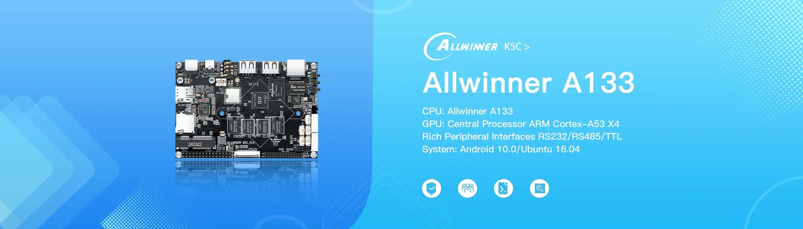
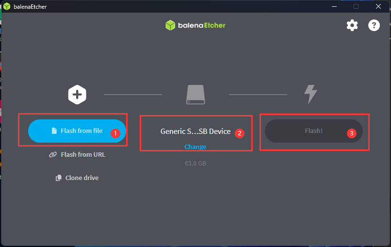
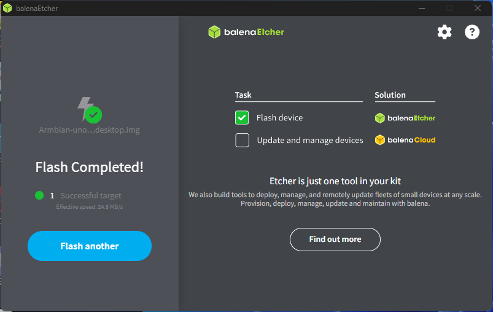
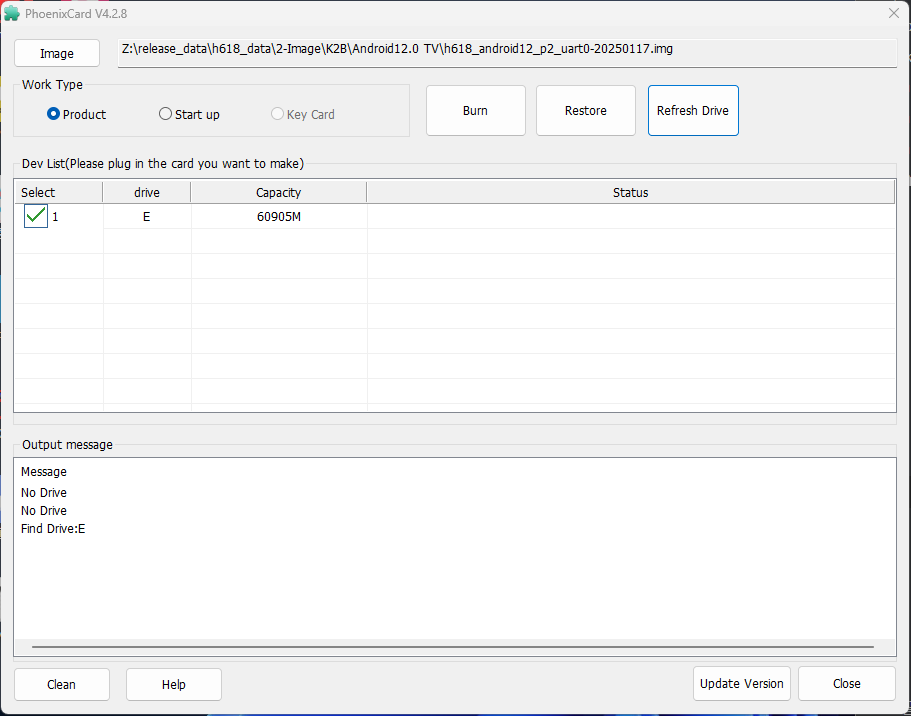
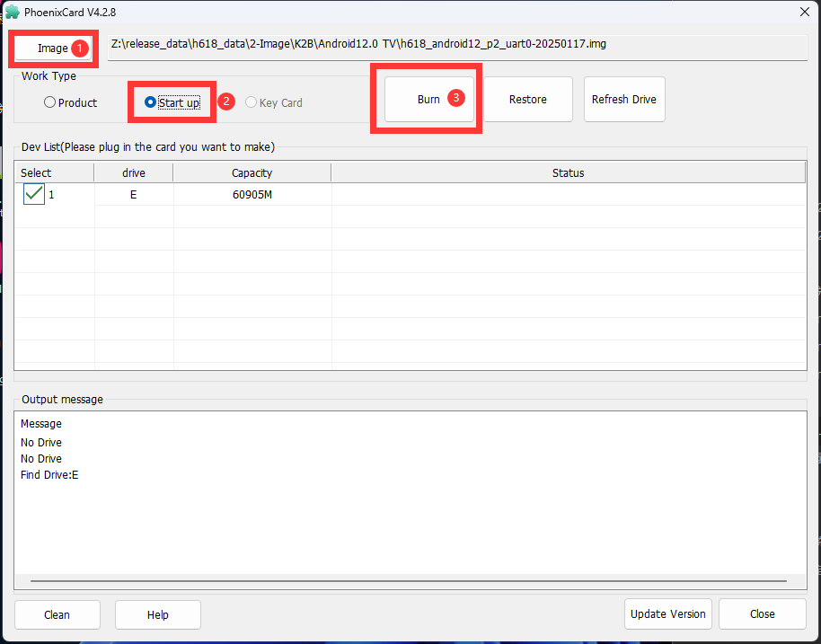
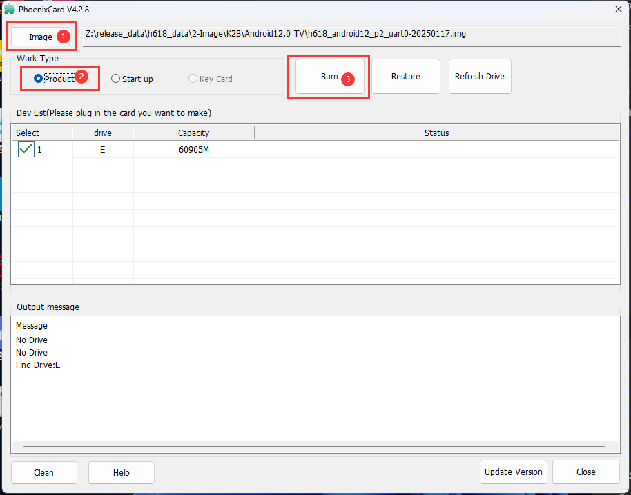
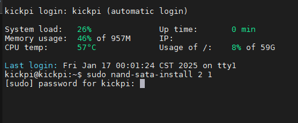
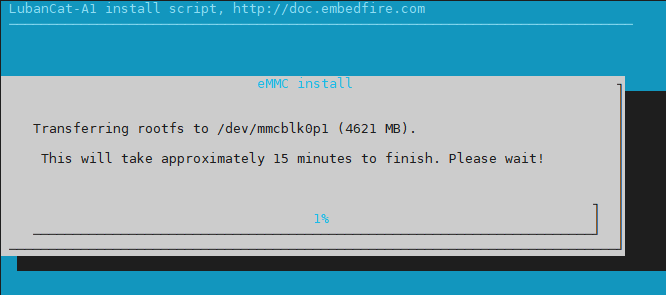
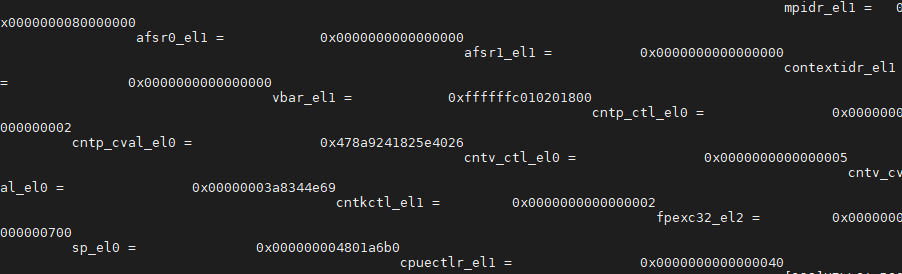
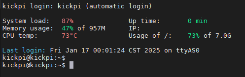

# KickPi K5C - SD Card Flashing Guide

## Overview

This guide will walk you through the process of flashing an operating system image to an SD card for use with the KickPi K5C development board (Allwinner A133).

## Supported Operating Systems

The KickPi K5C supports the following operating systems:
- **Android 10.0** - Full Android experience with touch support
- **Ubuntu 16.04** - Linux desktop environment for development

## Prerequisites

### Required Hardware
- KickPi K5C development board
- MicroSD card (Class 10, minimum 8GB recommended)
- MicroSD card reader
- Computer (Windows, macOS, or Linux)
- DC 12V power supply
- HDMI cable (for display output)

### Required Software
- **SD Card Formatter** - For preparing the SD card
- **Balena Etcher** or **Rufus** - For flashing images to SD card
- **Image file** - Downloaded KickPi K5C system image

## Step 1: Download System Images

### Official Download Sources
1. Visit the [KickPi K5C Product Page](https://www.kickpi.com/product/k5c/)
2. Navigate to the download section
3. Choose your preferred operating system:
   - **Android 10.0 Image** - For multimedia and app usage
   - **Ubuntu 16.04 Image** - For development and desktop use

## Step 2: Prepare the SD Card

### Format the SD Card
1. **Insert** the MicroSD card into your computer using a card reader
2. **Download and install** [SD Card Formatter](https://www.sdcard.org/downloads/formatter/)
3. **Open** SD Card Formatter
4. **Select** your SD card from the device list
5. **Choose** "Overwrite format" for thorough formatting
6. **Click** "Format" and wait for completion

⚠️ **Warning**: This will erase all data on the SD card. Make sure to backup any important files.

## Step 3: Flash the Image

### Using Balena Etcher (Recommended)

1. **Download and install** [Balena Etcher](https://www.balena.io/etcher/)
2. **Launch** Balena Etcher

3. **Click** "Flash from file" and select your downloaded image file
4. **Click** "Select target" and choose your SD card
5. **Click** "Flash!" to start the flashing process
6. **Wait** for the process to complete (typically 10-25 minutes)

7. **Safely eject** the SD card when done

### Using Rufus (Windows Alternative)

1. **Download and install** [Rufus](https://rufus.ie/)
2. **Insert** your SD card
3. **Open** Rufus
4. **Select** your SD card from the Device dropdown
5. **Click** "SELECT" and choose your image file
6. **Click** "START" to begin flashing
7. **Wait** for completion and safely eject

## Step 4: Boot from SD Card

### Hardware Setup
1. **Power off** the K5C board completely
2. **Insert** the flashed SD card into the K5C's SD card slot
3. **Connect** HDMI cable for display output
4. **Connect** keyboard and mouse (USB ports)
5. **Connect** Ethernet cable (optional, for internet access)

### Boot Process
1. **Press and hold** the **FEL KEY** button
2. **Connect** the DC 12V power supply
3. **Release** the FEL KEY after 3-5 seconds
4. The system should boot from the SD card automatically
5. **Wait** for the initial boot process (first boot may take 2-3 minutes)

## Step 5: Initial Configuration

### First Boot Setup
- **Android 10.0**: Follow the Android setup wizard
- **Ubuntu 16.04**: Complete the initial user account setup

### Network Configuration
1. **Ethernet**: Should connect automatically if cable is plugged in
2. **WiFi**: Configure through system settings
   - Module: AW869A
   - Supports WiFi5 standards

### Default Credentials
- Check the image documentation for default usernames and passwords
- It's recommended to change default credentials for security

## Troubleshooting

### Common Issues

#### SD Card Not Detected
- Ensure the SD card is properly formatted (FAT32)
- Try a different SD card (Class 10 recommended)
- Check that the SD card is fully inserted into the slot

#### Boot Fails
- Verify the image was flashed completely without errors
- Ensure you're holding the FEL KEY during power-on
- Try re-flashing the image with a slower write speed

#### Display Issues
- Check HDMI cable connection
- Try a different HDMI cable or monitor
- Verify the image supports your display resolution

#### Network Problems
- Check Ethernet cable connection
- Verify router/network settings
- For WiFi issues, check antenna connections

### Recovery Options

#### Re-flash SD Card
1. Format the SD card completely
2. Re-download the image file
3. Flash again using Balena Etcher
4. Verify the flash completed successfully

#### Alternative Boot Methods
- Try different SD cards
- Check for updated image files
- Contact KickPi support for assistance

## Advanced Configuration

### Enabling Additional Features
- **4G Mobile Network**: Install EC20/EC200 module if supported
- **Camera**: Connect MIPI CSI cameras (4 Lane X1 or 2 Lane X2)
- **GPIO Access**: Configure through system settings or command line

### Performance Optimization
- **Memory**: K5C has 2GB RAM - optimize applications accordingly
- **Storage**: Consider using faster SD cards for better performance
- **Cooling**: Monitor temperatures during intensive tasks

## Alternative Android Flashing Method

### Using PhoenixCard (For Android Images)

PhoenixCard is specifically designed for Allwinner Android images and offers additional features:

#### Start up Card (Boot from SD Card)

#### ProductCard (Install to eMMC)

### Advanced Ubuntu Installation

For Ubuntu systems, you can copy the installation from SD card to eMMC for better performance:

After successful completion:

## Support Resources

### Community Support
- KickPi Community Forums
- GitHub Issues and Discussions

## Safety Notes

⚠️ **Important Safety Information**:
- Always power off the board before inserting/removing SD cards
- Use only the recommended DC 12V power supply
- Ensure proper ventilation around the board
- Handle the board with anti-static precautions

---

*Last updated: October 2025*