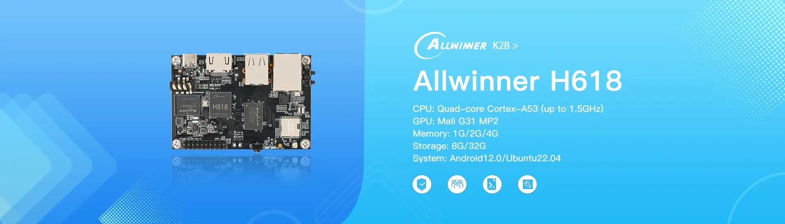

# KickPi K2B Development Board

## Overview

KICKPI-K2B is a development board based on the Allwinner H618 main control chip, with a quad-core 64-bit Cortex-A53 processor, main frequency up to 1.5 GHz, low power consumption, and high performance. Equipped with Gigabit high-speed network port, WIFI5, and Bluetooth 5.0 communication is stable and faster, suitable for a variety of scenarios.

## Specifications

### Processor
- **SoC**: Allwinner H618
- **CPU**: 64bits Quad-core Cortex-A53 (up to 1.5GHz)
- **GPU**: Mali G31 MP2
- **Systems Supported**: Android 12.0 / Ubuntu 22.04

### Memory & Storage
- **RAM**: 1G / 2G / 4G
- **Storage**: 8G / 32G
- **Expandable Storage**: MicroSD/eMMC

### Connectivity
- **Wi-Fi**: AW859
- **Bluetooth**: AW859
- **Ethernet**: 1000M X1
- **USB**: USB 2.0 HOST X2
- **USB OTG**: USB 2.0 OTG X1

### I/O Interfaces
- **GPIO**: [Add GPIO pin count and details]
- **UART**: UART X2
- **SPI**: SPI X1
- **I2C**: I2C X4
- **I2S**: I2S X1
- **SPDIF**: SPDIF X1
- **PWM**: PWM X4
- **Debug Serial Port**: Yes(GPIO)

### Buttons
- **Recovery KEY**
- **RESET KEY**
- **FEL KEY**

### Display & Audio
- **Display Interface**: HDMI X1 (up to 4K@60Hz)
- **Audio**: Headphone Jack
- **Camera**: No

### Power
- **Power Supply**: Type-C 5V
- **Power Consumption**: 2 ~ 3Amp
- **Battery Support**: No

### Hardware interface

## Getting Started

### Prerequisites
- [List required tools and software]
- [Development environment setup]

### Quick Start Guide

1. **Hardware Setup**
   - [Step-by-step hardware connection guide]
   - [Power supply connection]
   - [Essential connections]

2. **Software Installation**
   - [Operating system installation steps]
   - [Driver installation]
   - [Development tools setup]

3. **First Boot**
   - [Initial boot process]
   - [Configuration steps]
   - [Verification procedures]

## Software Support

### Operating Systems
- [ ] [List supported operating systems]
- [ ] [Include download links when available]

### Development Tools
- [ ] [List compatible IDEs and tools]
- [ ] [SDK information]

### Examples & Tutorials
- [ ] [Link to example projects]
- [ ] [Getting started tutorials]

## Hardware Resources

### Pinout Diagram
- [Add pinout diagram or link to detailed pinout]

### Schematic & Layout
- [Link to schematic files]
- [PCB layout information]

### Mechanical Drawings
- [Board dimensions]
- [Mounting hole specifications]
- [3D models if available]

## Documentation

### Technical Documents
- [ ] [Datasheet link]
- [ ] [User manual]
- [ ] [Hardware reference guide]

### Application Notes
- [ ] [Specific use case guides]
- [ ] [Integration examples]
- [ ] [Best practices]

## Community & Support

### Resources
- [KickPi Official Website](https://www.kickpi.com/)

## Changelog

### Version History
- **v1.0** - [Date] - Initial release
- [Add version history as development progresses]

## License

This documentation is provided under the same license as the KickPi Documentation repository.

---

*Last updated: October 2025*