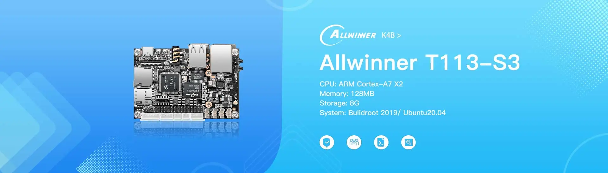

# KickPi K4B - SD Card Flashing Guide

## Overview

This guide will walk you through the process of flashing an operating system image to an SD card for use with the KickPi K4B development board (Allwinner T113-S3).

## Supported Operating Systems

The KickPi K4B supports the following operating systems:
- **Buildroot 2019** - Lightweight embedded Linux system
- **Ubuntu 20.04** - Developer-friendly desktop environment

## Prerequisites

### Required Hardware
- KickPi K4B development board
- MicroSD card (Class 10, minimum 8GB recommended)
- MicroSD card reader
- Computer (Windows, macOS, or Linux)
- USB Type-C power supply (5V)
- HDMI cable (for display output)

### Required Software
- **SD Card Formatter** - For preparing the SD card
- **Balena Etcher** or **Rufus** - For flashing images to SD card
- **Image file** - Downloaded KickPi K4B system image

## Step 1: Download System Images

### Official Download Sources
1. Visit the [KickPi K4B Product Page](https://www.kickpi.com/product/k4b/)
2. Navigate to the download section
3. Choose your preferred operating system:
   - **Buildroot 2019 Image** - For embedded applications and minimal systems
   - **Ubuntu 20.04 Image** - For development and desktop use

## Step 2: Prepare the SD Card

### Format the SD Card
1. **Insert** the MicroSD card into your computer using a card reader
2. **Download and install** [SD Card Formatter](https://www.sdcard.org/downloads/formatter/)
3. **Open** SD Card Formatter
4. **Select** your SD card from the device list
5. **Choose** "Overwrite format" for thorough formatting
6. **Click** "Format" and wait for completion

⚠️ **Warning**: This will erase all data on the SD card. Make sure to backup any important files.

## Step 3: Flash the Image

### Using Balena Etcher (Recommended)

1. **Download and install** [Balena Etcher](https://www.balena.io/etcher/)
2. **Launch** Balena Etcher
3. **Click** "Flash from file" and select your downloaded image file
4. **Click** "Select target" and choose your SD card
5. **Click** "Flash!" to start the flashing process
6. **Wait** for the process to complete (typically 10-30 minutes)
7. **Safely eject** the SD card when done

### Using Rufus (Windows Alternative)

1. **Download and install** [Rufus](https://rufus.ie/)
2. **Insert** your SD card
3. **Open** Rufus
4. **Select** your SD card from the Device dropdown
5. **Click** "SELECT" and choose your image file
6. **Click** "START" to begin flashing
7. **Wait** for completion and safely eject

## Step 4: Boot from SD Card

### Hardware Setup
1. **Power off** the K4B board completely
2. **Insert** the flashed SD card into the K4B's SD card slot
3. **Connect** HDMI cable for display output (up to 4K@60Hz)
4. **Connect** keyboard and mouse (USB ports)
5. **Connect** Ethernet cable (optional, for 100M internet access)

### Boot Process
1. **Press and hold** the **MASKROM KEY** button
2. **Connect** the USB Type-C power supply (5V)
3. **Release** the MASKROM KEY after 3-5 seconds
4. The system should boot from the SD card automatically
5. **Wait** for the initial boot process (first boot may take 2-3 minutes)

## Step 5: Initial Configuration

### First Boot Setup
- **Buildroot 2019**: Command line interface with minimal setup
- **Ubuntu 20.04**: Complete the initial user account setup

### Network Configuration
1. **Ethernet**: 100M connection should connect automatically
2. **WiFi**: Configure through system settings
   - Module: RTL8723BU
   - Supports standard WiFi protocols

### Default Credentials
- Check the image documentation for default usernames and passwords
- It's recommended to change default credentials for security

## Troubleshooting

### Common Issues

#### SD Card Not Detected
- Ensure the SD card is properly formatted (FAT32)
- Try a different SD card (Class 10 recommended)
- Check that the SD card is fully inserted into the slot

#### Boot Fails
- Verify the image was flashed completely without errors
- Ensure you're holding the MASKROM KEY during power-on
- Try re-flashing the image with a slower write speed

#### Display Issues
- Check HDMI cable connection (supports up to 4K@60Hz)
- Try a different HDMI cable or monitor
- Test MIPI DSI (1080P@60Hz) or LVDS (1080P@60Hz) displays
- Verify the image supports your display resolution

#### Network Problems
- Check Ethernet cable connection (100M support)
- Verify router/network settings
- For WiFi issues, check antenna connections

### Recovery Options

#### Re-flash SD Card
1. Format the SD card completely
2. Re-download the image file
3. Flash again using Balena Etcher
4. Verify the flash completed successfully

#### Alternative Boot Methods
- Try different SD cards
- Check for updated image files
- Contact KickPi support for assistance

## Advanced Configuration

### Enabling Additional Features
- **4G Mobile Network**: Install EC20/EC200 module
- **Camera**: Connect MIPI CSI cameras (4 Lane X1 or 2 Lane X2)
- **Speaker**: Built-in 2W speaker support
- **GPIO Access**: 20-pin expansion interface available

### Performance Optimization
- **Memory**: Built-in 128MB RAM
- **Storage**: 8GB internal storage
- **NPU**: RKNN 0.8 Tops for AI applications

### Expansion Interface Details
**20-Pin Interface includes:**
- UART X2
- SPI X1
- PWM X1
- ADC X1
- I2C X1
- GPIO X14

### Display Options
- **HDMI**: Up to 4K@60Hz
- **MIPI DSI**: Up to 1920x1080@60Hz
- **LVDS**: Up to 1920x1080@60Hz

## Support Resources

### Community Support
- KickPi Community Forums
- GitHub Issues and Discussions

## Safety Notes

⚠️ **Important Safety Information**:
- Always power off the board before inserting/removing SD cards
- Use only USB Type-C 5V power supplies
- Ensure proper ventilation around the board
- Handle the board with anti-static precautions
- The built-in 128MB RAM requires careful memory management

---

*Last updated: October 2025*