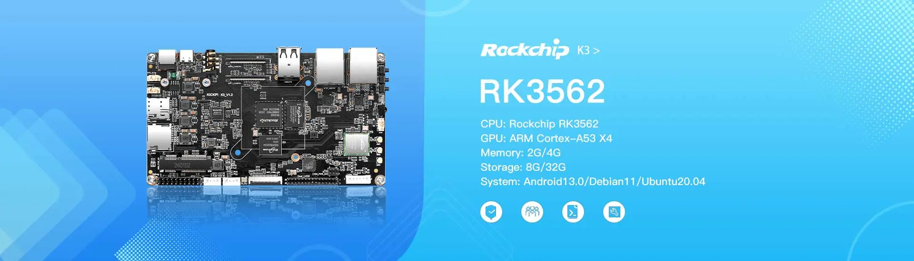

# KickPi K3 Development Board

## Overview

KICKPI-K3 is a development board based on Rockchip RK3562, the main control chip. It has a quad-core 64-bit Cortex-A53 processor, a main frequency of up to 2.0GHz, low power consumption, and high performance. The board supports multiple network communication methods, such as dual network and dual-band WIFI, with stable communication and faster speed, suitable for various scene requirements.

## Key Features

- **Quad-core 64-bit processor**: Cortex-A53, RK3562, 22nm technology, up to 2.0GHz
- **Powerful network communication**: Dual network and dual-band WIFI support
- **Video decoding and multi-screen display**: 1080P@60fps, Dual LVDS and MIPI DSI interfaces
- **Multiple system support**: Android 13.0/Debian 11/Ubuntu 20.04
- **Wide application fields**: Commercial tablets, video conferences, smart homes, educational electronics, medical equipment

## Application Areas

- IoT Smart Internet of Things
- Commercial display
- Industrial control
- AI artificial intelligence
- Medical technology
- Industrial Inspection

## Specifications

### Processor
- **SoC**: Rockchip RK3562
- **CPU**: Quad-core ARM Cortex-A53 X4 (up to 2.0GHz)
- **GPU**: Mali G52 2EE
- **NPU**: RKNN 1 Tops
- **Systems Supported**: Android 13.0 / Debian 11 / Ubuntu 20.04

### Memory & Storage
- **Memory**: 2G / 4G
- **Storage**: 8G / 32G
- **SD-Card**: MicroSD Card Support
- **M.2 Hard Drive**: Yes

### Connectivity
- **WIFI/Bluetooth**: RTL8822CS
- **Ethernet**: 1000M X1, 100M X1
- **4G Mobile Network**: EC20/EC200
- **USB HOST**: USB 2.0 HOST X2
- **USB OTG**: USB 2.0 OTG X1

### Expansion Pins
**Total 20Pin Expansion Interface:**
- **UART**: X3
- **I2C**: X1
- **USB 2.0 HOST**: X1
- **PWM**: X1
- **ADC**: X1
- **GPIO**: X11

### Buttons & Indicators
- **Buttons**: Recovery KEY, RESET KEY, MASKROM KEY, POWER KEY
- **LED Lights**: Power LED, Work LED
- **Infrared Receiver**: Yes
- **Real-Time Clock**: HYM8563
- **Cooling Fan**: Yes

### Display & Audio
- **MIPI DSI LCD**: X1 (up to 1920x1080@60Hz)
- **Single LVDS LCD**: X1 (up to 1280x720@60Hz)
- **Dual LVDS LCD**: X1 (up to 1920x1080@60Hz)
- **MIPI CSI Camera**: 4 Lane X2 or 2 Lane X4
- **Speaker**: Yes (Max Power 5W)
- **Headphones**: Yes
- **Microphone**: Yes

### Power
- **Power Supply**: DC 12V

### Hardware interface

## Getting Started

### Prerequisites
- [List required tools and software]
- [Development environment setup]

### Quick Start Guide

1. **Hardware Setup**
   - [Step-by-step hardware connection guide]
   - [Power supply connection]
   - [Essential connections]

2. **Software Installation**
   - [Operating system installation steps]
   - [Driver installation]
   - [Development tools setup]

3. **First Boot**
   - [Initial boot process]
   - [Configuration steps]
   - [Verification procedures]

## Software Support

### Operating Systems
- [ ] [List supported operating systems]
- [ ] [Include download links when available]

### Development Tools
- [ ] [List compatible IDEs and tools]
- [ ] [SDK information]

### Examples & Tutorials
- [ ] [Link to example projects]
- [ ] [Getting started tutorials]

## Hardware Resources

### Pinout Diagram
- [Add pinout diagram or link to detailed pinout]

### Schematic & Layout
- [Link to schematic files]
- [PCB layout information]

### Mechanical Drawings
- [Board dimensions]
- [Mounting hole specifications]
- [3D models if available]

## Documentation

### Technical Documents
- [ ] [Datasheet link]
- [ ] [User manual]
- [ ] [Hardware reference guide]

### Application Notes
- [ ] [Specific use case guides]
- [ ] [Integration examples]
- [ ] [Best practices]

## Community & Support

### Resources
- [KickPi K3 Product Page](https://www.kickpi.com/product/k3/)

## Changelog

### Version History
- **v1.0** - [Date] - Initial release
- [Add version history as development progresses]

## License

This documentation is provided under the same license as the KickPi Documentation repository.

---

*Last updated: October 2025*