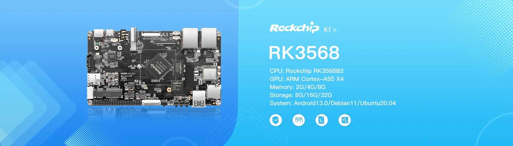

# KickPi K1 Development Board

## Overview

The KickPi K1 is a development board based on the Rockchip RK3568 processor, designed for IoT applications, smart home solutions, and embedded development projects.

## Specifications

### Processor
- **SoC**: Rockchip RK3568
- **CPU**: [Add CPU details]
- **GPU**: [Add GPU details]
- **Systems Supported**: [Add supported os details]

### Memory & Storage
- **RAM**: [Add RAM specifications]
- **Storage**: [Add storage options]
- **Expandable Storage**: [Add microSD/eMMC details]

### Connectivity
- **Wi-Fi**: [Add Wi-Fi specifications]
- **Bluetooth**: [Add Bluetooth version]
- **Ethernet**: [Add Ethernet details if available]
- **USB**: [Add USB port specifications]

### I/O Interfaces
- **GPIO**: [Add GPIO pin count and details]
- **UART**: [Add UART specifications]
- **SPI**: [Add SPI specifications]
- **I2C**: [Add I2C specifications]
- **PWM**: [Add PWM specifications]

### Display & Audio
- **Display Interface**: [Add display connector details]
- **Audio**: [Add audio input/output specifications]
- **Camera**: [Add camera interface details]

### Power
- **Power Supply**: [Add power requirements]
- **Power Consumption**: [Add power consumption details]
- **Battery Support**: [Add battery connector details if available]

## Getting Started

### Prerequisites
- [List required tools and software]
- [Development environment setup]

### Quick Start Guide

1. **Hardware Setup**
   - [Step-by-step hardware connection guide]
   - [Power supply connection]
   - [Essential connections]

2. **Software Installation**
   - [Operating system installation steps]
   - [Driver installation]
   - [Development tools setup]

3. **First Boot**
   - [Initial boot process]
   - [Configuration steps]
   - [Verification procedures]

## Software Support

### Operating Systems
- [ ] [List supported operating systems]
- [ ] [Include download links when available]

### Development Tools
- [ ] [List compatible IDEs and tools]
- [ ] [SDK information]

### Examples & Tutorials
- [ ] [Link to example projects]
- [ ] [Getting started tutorials]

## Hardware Resources

### Pinout Diagram
- [Add pinout diagram or link to detailed pinout]

### Schematic & Layout
- [Link to schematic files]
- [PCB layout information]

### Mechanical Drawings
- [Board dimensions]
- [Mounting hole specifications]
- [3D models if available]

## Documentation

### Technical Documents
- [ ] [Datasheet link]
- [ ] [User manual]
- [ ] [Hardware reference guide]

### Application Notes
- [ ] [Specific use case guides]
- [ ] [Integration examples]
- [ ] [Best practices]

## Community & Support

### Resources
- [KickPi Official Website](https://www.kickpi.com/)

## Changelog

### Version History
- **v1.0** - [Date] - Initial release
- [Add version history as development progresses]

## License

This documentation is provided under the same license as the KickPi Documentation repository.

---

*Last updated: October 2025*