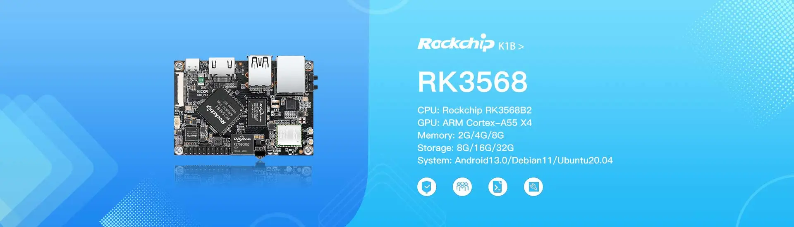

# KickPi K1B Development Board

## Overview

KICKPI-K1B is a development board based on the RK3568 chip. It adopts a high-performance ARM Cortex-A55 X4 processor with an advanced 22nm process, and the main frequency is up to 2.0GHz, with low power consumption and high performance. It supports a variety of network communication modes such as Gigabit wide network, dual-band WIFI, etc., with stable communication and faster speed, which is suitable for various scenarios.

## Key Features

- **Quad-core 64-bit processor**: Cortex-A55, RK3568, 22nm technology, up to 2.0GHz
- **Powerful network communication**: 4G mobile network, dual gigabit, dual-band WIFI
- **4K video decoding**: 4K@60fps/1080P@60fps, dual/triple screen simultaneous display
- **Multiple system support**: Android 13.0/Debian 11/Ubuntu 20.04
- **Wide application fields**: IoT gateways, NVR storage, industrial control tablets, testing, karaoke, cloud terminals, in-car central control

## Application Areas

- IoT Smart Internet of Things
- Commercial display
- AI artificial intelligence
- Industrial control
- Medical technology
- Industrial Inspection

## Specifications

### Processor
- **SoC**: Rockchip RK3568
- **CPU**: Quad-core Cortex-A55 (up to 2.0GHz)
- **GPU**: Mali G52 2EE
- **NPU**: RKNN 0.8 Tops
- **Systems Supported**: Android 13.0 / Debian 11 / Ubuntu 20.04

### Memory & Storage
- **Memory**: 2G / 4G / 8G
- **Storage**: 8G / 16G / 32G
- **SD-Card**: MicroSD Card Support

### Connectivity
- **WIFI/Bluetooth**: RTL8822CS
- **Ethernet**: 1000M X1
- **USB HOST**: USB 2.0 HOST X1, USB 3.0 HOST X1
- **USB OTG**: USB 2.0 OTG X1

### Expansion Pins
**Total 20Pin Expansion Interface:**
- **UART**: X2
- **SPI**: X1
- **PWM**: X1
- **ADC**: X1
- **I2C**: X1
- **GPIO**: X14

### Buttons & Indicators
- **Buttons**: Recovery KEY, RESET KEY, MASKROM KEY
- **LED Lights**: Power LED, Work LED
- **Infrared Receiver**: Yes
- **Debug Serial Port**: Yes

### Display & Audio
- **HDMI Display**: X1 (up to 4K@60Hz)
- **MIPI DSI Display**: X1 (up to 1920x1080@60Hz)
- **LVDS Display**: X1 (up to 1920x1080@60Hz)
- **MIPI CSI Camera**: 4 Lane X1 or 2 Lane X2
- **Speaker**: Yes (Max Power 2W)

### Power
- **Power Supply**: Type-C 5V

### Hardware interface

## Getting Started

### Prerequisites
- [List required tools and software]
- [Development environment setup]

### Quick Start Guide

1. **Hardware Setup**
   - [Step-by-step hardware connection guide]
   - [Power supply connection]
   - [Essential connections]

2. **Software Installation**
   - [Operating system installation steps]
   - [Driver installation]
   - [Development tools setup]

3. **First Boot**
   - [Initial boot process]
   - [Configuration steps]
   - [Verification procedures]

## Software Support

### Operating Systems
- [ ] [List supported operating systems]
- [ ] [Include download links when available]

### Development Tools
- [ ] [List compatible IDEs and tools]
- [ ] [SDK information]

### Examples & Tutorials
- [ ] [Link to example projects]
- [ ] [Getting started tutorials]

## Hardware Resources

### Pinout Diagram
- [Add pinout diagram or link to detailed pinout]

### Schematic & Layout
- [Link to schematic files]
- [PCB layout information]

### Mechanical Drawings
- [Board dimensions]
- [Mounting hole specifications]
- [3D models if available]

## Documentation

### Technical Documents
- [ ] [Datasheet link]
- [ ] [User manual]
- [ ] [Hardware reference guide]

### Application Notes
- [ ] [Specific use case guides]
- [ ] [Integration examples]
- [ ] [Best practices]

## Community & Support

### Resources
- [KickPi K1B Product Page](https://www.kickpi.com/product/k1b/)

## Changelog

### Version History
- **v1.0** - [Date] - Initial release
- [Add version history as development progresses]

## License

This documentation is provided under the same license as the KickPi Documentation repository.

---

*Last updated: October 2025*