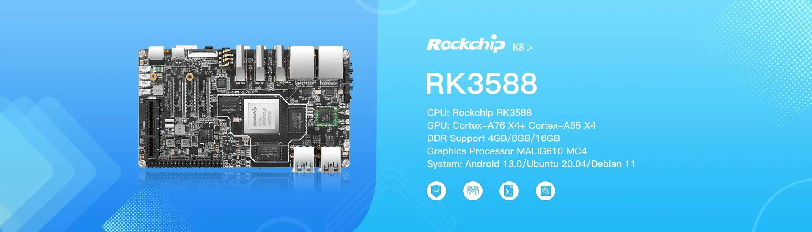

# KickPi K8 - SD Card Flashing Guide

## Overview

This guide will walk you through the process of flashing an operating system image to an SD card for use with the KickPi K8 development board (Rockchip RK3588S).

## Supported Operating Systems

The KickPi K8 supports the following operating systems:
- **Android 14.0** - Latest Android experience with enhanced performance
- **Debian 12** - Latest stable Linux distribution optimized for development
- **Ubuntu 24.04** - Latest Ubuntu LTS for desktop and enterprise applications

## Prerequisites

### Required Hardware
- KickPi K8 development board
- MicroSD card (Class 10, minimum 16GB recommended, 32GB+ for optimal performance)
- MicroSD card reader
- Computer (Windows, macOS, or Linux)
- DC 12V power supply
- HDMI cable (for display output)

### Required Software
- **SD Card Formatter** - For preparing the SD card
- **Balena Etcher** or **Rufus** - For flashing images to SD card
- **Image file** - Downloaded KickPi K8 system image

## Step 1: Download System Images

### Official Download Sources
1. Visit the [KickPi K8 Product Page](https://www.kickpi.com/product/k8/)
2. Navigate to the download section
3. Choose your preferred operating system:
   - **Android 14.0 Image** - For advanced multimedia and latest Android features
   - **Debian 12 Image** - For stable development and server applications
   - **Ubuntu 24.04 Image** - For latest desktop features and enterprise development

## Step 2: Prepare the SD Card

### Format the SD Card
1. **Insert** the MicroSD card into your computer using a card reader
2. **Download and install** [SD Card Formatter](https://www.sdcard.org/downloads/formatter/)
3. **Open** SD Card Formatter
4. **Select** your SD card from the device list
5. **Choose** "Overwrite format" for thorough formatting
6. **Click** "Format" and wait for completion

⚠️ **Warning**: This will erase all data on the SD card. Make sure to backup any important files.

## Step 3: Flash the Image

### Using Balena Etcher (Recommended)

1. **Download and install** [Balena Etcher](https://www.balena.io/etcher/)
2. **Launch** Balena Etcher
3. **Click** "Flash from file" and select your downloaded image file
4. **Click** "Select target" and choose your SD card
5. **Click** "Flash!" to start the flashing process
6. **Wait** for the process to complete (typically 20-60 minutes due to high-performance features)
7. **Safely eject** the SD card when done

### Using Rufus (Windows Alternative)

1. **Download and install** [Rufus](https://rufus.ie/)
2. **Insert** your SD card
3. **Open** Rufus
4. **Select** your SD card from the Device dropdown
5. **Click** "SELECT" and choose your image file
6. **Click** "START" to begin flashing
7. **Wait** for completion and safely eject

## Step 4: Boot from SD Card

### Hardware Setup
1. **Power off** the K8 board completely
2. **Insert** the flashed SD card into the K8's SD card slot
3. **Connect** HDMI cable for display output (up to 8K@60Hz)
4. **Connect** keyboard and mouse (USB 3.0 ports)
5. **Connect** Ethernet cable (dual 2.5G ports available)

### Boot Process
1. **Press and hold** the **MASKROM KEY** button
2. **Connect** the DC 12V power supply
3. **Release** the MASKROM KEY after 3-5 seconds
4. The system should boot from the SD card automatically
5. **Wait** for the initial boot process (first boot may take 5-8 minutes due to advanced features)

## Step 5: Initial Configuration

### First Boot Setup
- **Android 14.0**: Follow the Android setup wizard with enhanced AI features
- **Debian 12**: Complete the initial user account setup
- **Ubuntu 24.04**: Complete the initial user account setup

### Network Configuration
1. **Ethernet**: Dual 2.5 gigabit should connect automatically
2. **WiFi**: Configure through system settings
   - Module: RTL8822CS
   - Supports dual-band WiFi with enhanced performance
3. **5G Mobile Network**: 5G RG200U module support for next-generation connectivity

### Default Credentials
- Check the image documentation for default usernames and passwords
- It's recommended to change default credentials for security

## Advanced Configuration

### Enabling High-Performance Features
- **5G Mobile Network**: Install 5G RG200U module for ultra-fast connectivity
- **SATA Hard Drive**: Connect high-speed SATA storage
- **M.2 Hard Drive**: Install M.2 NVMe SSD for maximum performance
- **Multiple 8K Displays**: Support for multiple ultra-high resolution displays
- **Audio**: Configure high-quality speakers (5W max), headphones, and microphone
- **Advanced Cooling**: Enhanced cooling fan support for sustained performance

### Performance Optimization
- **Memory**: Available in 8G/16G/32G variants for maximum performance
- **Storage**: Available in 32G/64G variants for extensive applications
- **NPU**: RKNN 6 Tops with enhanced AI acceleration capabilities
- **GPU**: Mali-G610 MP4 for advanced graphics processing
- **Real-Time Clock**: HYM8563 with battery backup for accurate timekeeping

### Expansion Interface Details
**40-Pin Interface includes:**
- UART X4 (high-speed variants)
- SPI X1 (enhanced speed)
- PWM X11 (precision control)
- ADC X1 (high-resolution)
- I2C X2 (fast mode)
- GPIO X28 (advanced capabilities)

### Display Configuration
- **HDMI**: Up to 8K@60Hz or dual 4K@60Hz
- **MIPI DSI**: X2 (up to 2560x1600@60Hz each)
- **LVDS**: Up to 1920x1080@60Hz
- **EDP**: Up to 2560x1600@60Hz

### AI and Machine Learning Features
- **NPU Performance**: 6 TOPS for real-time AI inference
- **AI Frameworks**: Support for TensorFlow, PyTorch, ONNX
- **Computer Vision**: Advanced image processing capabilities
- **Edge Computing**: Optimized for AI edge applications

## Performance Monitoring

### System Resources
- Monitor CPU usage across 8 cores (4xCortex-A76 + 4xCortex-A55)
- Track memory usage (8G/16G/32G variants)
- Monitor NPU utilization during AI workloads
- Watch thermal performance with cooling systems

### Benchmarking Tools
- **CPU**: sysbench, stress-ng
- **GPU**: glmark2, gpu_mem_test
- **NPU**: RKNN Toolkit performance tests
- **Storage**: hdparm, fio

## Support Resources

### Development Resources
- RKNN SDK and Documentation
- Mali GPU Development Guide
- Android 14.0 Developer Resources

### Community Support
- KickPi Community Forums
- GitHub Issues and Discussions
- Developer Community Channels

## Safety and Performance Notes

⚠️ **Important Safety and Performance Information**:
- Always power off the board before inserting/removing SD cards
- Use only the recommended DC 12V power supply with adequate current capacity
- Ensure excellent ventilation and cooling for sustained high-performance operation
- Handle the board with anti-static precautions
- Monitor system temperatures during intensive AI/GPU/NPU operations
- The high-performance RK3588S processor requires proper thermal management
- Consider active cooling for continuous high-performance workloads
- Monitor power consumption during peak performance scenarios

---

*Last updated: October 2025*